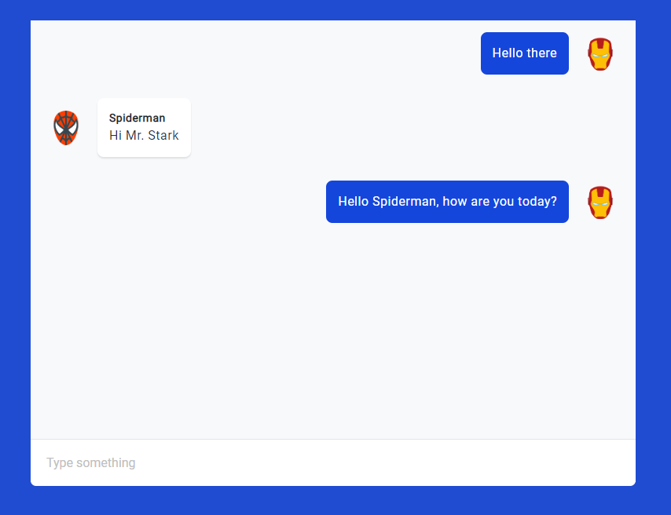
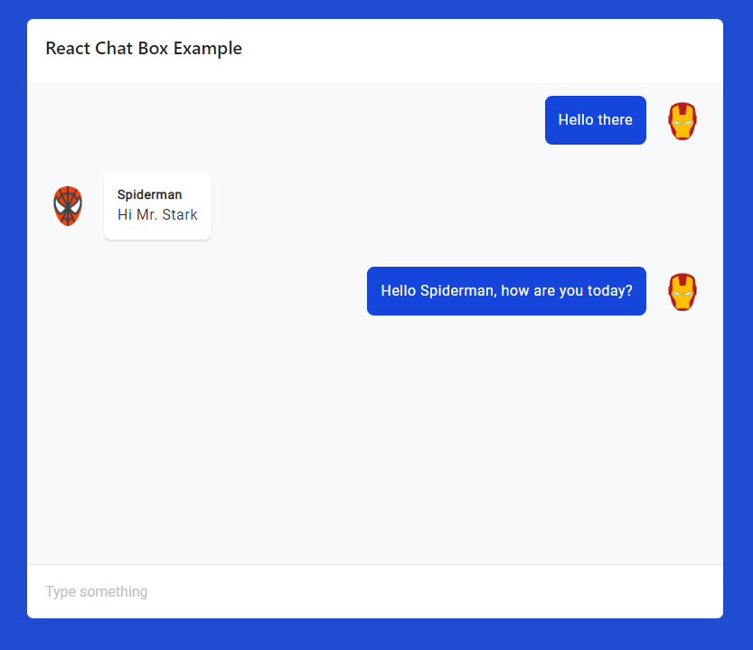

# Introduction

Plug and play Chat component for creating React Chat App.

In isolation, the component looks like this:



The idea is that you embed this component in your own container, for example a pop-up chat widget or beneath a heading:



Really, the aim is to make implementing a chat component as quick as possible.  All you need to do is pass an array of `message`s (normally `this.state.messages`, unless you're using hooks):

```js
import {ChatBox} from 'react-chatbox-component';

const messages = [
  {
    "text": "Hello there",
    "id": "1",
    "sender": {
      "name": "Ironman",
      "uid": "user1",
      "avatar": "https://data.cometchat.com/assets/images/avatars/ironman.png",
    },
  },
]

<ChatBox
  messages={messages}
/>
```

To differentiate bubble color, you can use the pass a `user` object with a `uid` property. When sender `uid` matched the `user` `uid`, it will render message from the right side.

```js
const user = {
  "uid" : "user1"
}

<ChatBox
  messages={messages}
  user={user}
/>
```

If you built your own chat server, you may need to map `messages` and `user` to match this data structure. If you're using CometChat, the structure is identical.

See an example [here](/src/test/App.js#L16) (no cussing, please).

## Features

- [x] Responsive
- [x] Automatically scrolls to bottom
- [x] Really easy and quick to use
- [x] Customise the colours to match your app
- [x] Pass your own rendering functions to tweak things like the chat bubble or (optional) typing indicator

## Installation

```bash
npm install react-chatbox-component
```

## How to use

I wrote a tutorial on how to make the chat box work with message history, typing indicators, and more here. Find the example source code here too.

The ChatBox component has the following API:

- `messages` _(array)_ - array of messages to render inside the chat interface
- `onSubmit` _(function)_ - function to execute when user submit a new message. Will log new message into the console if not used
- `isLoading` _(boolean)_ - display a loading screen when the value is `true`
- `user` _(object)_ - the currently logged in user. Used to differentiate message bubble color
- `renderMessage` _(optional)_ _(function)_ - optional function to render chat bubbles
- `typingListener` _(optional)_ _(function)_ - optional function executed when user is typing
- `typingIndicator`_(optional)_ _(element)_ - JSX element to render at the bottom of chat interface. Used to show that a user is typing

Here is a typical implementation for this component:

```js
import {ChatBox} from 'react-chatbox-component';

<div className='container'>
  <div className='chat-header'>
    <h5>React Chat Box Example</h5>
  </div>
  <ChatBox messages={this.state.messages} />
</div>
```

## Ready Example

If you'd like to help in development or just curious with how things work, you can run a local copy of this repo by following these steps:

- Download or clone this repository
- In the `react-chatbox-component` directory, run `npm install`
- run `npm start`

The application entry point is located in `src/test/App.js` while the library is in `src/lib/` directory.

Any contribution, no matter how small, is greatly appreciated.
